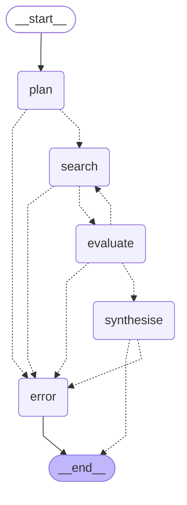

# research-assistant

An autonomous research agent built with LangGraph and FastAPI.
Submit a topic → the agent plans sub-questions, searches the web,
evaluates whether it has enough information, and returns a
structured briefing.

## Architecture

## How it works

Brief description of each node: plan → search → evaluate
(loop) → synthesise

## Quick start

1. Copy `.env.example` to `.env` and fill in keys
2. `docker compose up --build`
3. POST to `/research` (example below)

## Example request

\`\`\`bash
curl -X POST http://localhost:8000/research \
 -H "Content-Type: application/json" \
 -d '{"query": "AI applications in retail logistics", "domain": "retail"}'
\`\`\`

## Example response

[paste a real response from a test run - truncated is fine]

## Project structure

Brief description of agent/, api/, shared/
